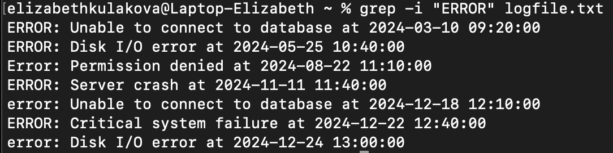
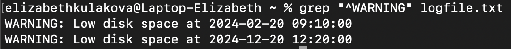

# Лабораторная работа по `grep`

1. Создала файл `logfile.txt` с следующим содержанием:

```
cat > logfile.txt <<EOL
INFO: User logged out from IP 192.168.1.10 at 2024-01-15 10:10:00
WARNING: Low disk space at 2024-02-20 09:10:00
ERROR: Unable to connect to database at 2024-03-10 09:20:00
info: User logged in from IP 192.168.1.20 at 2024-04-05 10:30:00
ERROR: Disk I/O error at 2024-05-25 10:40:00
Warning: Network latency detected at 2024-06-18 10:50:00
INFO: Backup started at 2024-07-30 11:00:00
Error: Permission denied at 2024-08-22 11:10:00
warning: High memory usage at 2024-09-05 11:20:00
Info: System update completed at 2024-10-10 11:30:00
ERROR: Server crash at 2024-11-11 11:40:00
Warning: Firewall issue at 2024-12-01 11:50:00
INFO: File uploaded to server at 2024-12-15 12:00:00
error: Unable to connect to database at 2024-12-18 12:10:00
WARNING: Low disk space at 2024-12-20 12:20:00
info: User logged out from IP 192.168.1.10 at 2024-12-21 12:30:00
ERROR: Critical system failure at 2024-12-22 12:40:00
Info: System shutdown initiated at 2024-12-23 12:50:00
error: Disk I/O error at 2024-12-24 13:00:00
EOL
```
2. Найду строки, содержащие слово "ERROR" (независимо от регистра). Использую команду grep с флагом -i для игнорирования регистра:

```
grep -i "ERROR" logfile.txt
```
Результат выполнения команды:
<p align="center">
 
</p>

3. Вывод строк, содержащих слово "WARNING" в начале строки. Использую регулярное выражение для поиска строк, начинающихся с "WARNING":
```
grep "^WARNING" logfile.txt
```
Результат выполнения:
<p align="center">
 
</p>

4. Поиск строк, содержащих IP-адреса в формате 192.168.x.x. Использую регулярное выражение для поиска IP-адресов. В этом выражении применим флаг `-Е` для того, чтобы использовать расширенные регулярные выражения (аналог `egrep`):
```
grep -E "192\.168\.[0-9]{1,3}\.[0-9]{1,3}" logfile.txt
```
Результат выполнения:
<p align="center">
 
</p>

5. Подсчет количества строк с предупреждениями (слово "WARNING" именно в таком регистре). Использую флаг -c для подсчета строк:
```
grep "WARNING" logfile.txt -c
```
Результат выполнения:
<p align="center">
 
</p>

6. Найти все строки, произошедшие в конкретный день или в конкретный месяц. Выберу 18 число и 12 месяц:

Всё, что произошло 18 числа:
```
grep "18 " logfile.txt
```
Результат выполнения:
<p align="center">
 
</p>

Всё, что произошло в 12 месяце:
```
grep "12-" logfile.txt
```
Результат выполнения:
<p align="center">
 
</p>

